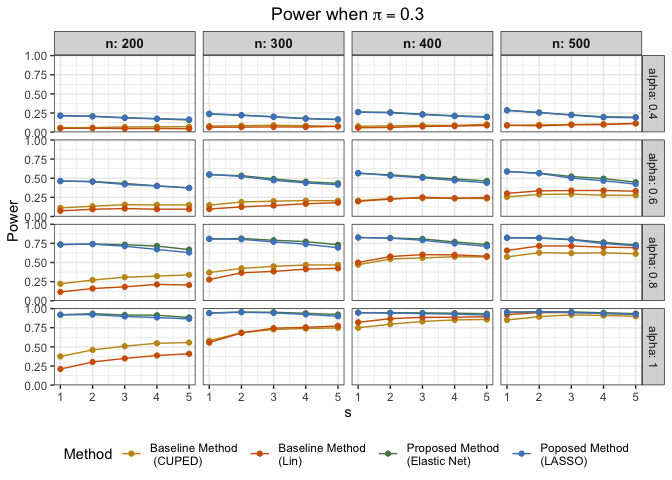

identifying_sparse_treatment_effect_simulation
================
Yujin Jeong
9/3/2024

``` r
gen_data <- function(n, m, d, s, p, alpha, sigma = 1){
  # randomly generate beta and delta with uniform functions
  beta = t(replicate(d, runif(m, min=-1, max=1)))
  delta = t(replicate(s, runif(m)))
  treatment = rbinom(n, 1, p)
  # randomly generate X and Y
  X = matrix(rnorm(n*m, sd=1), nrow=n, ncol=m)
  Y = matrix(0, nrow=n, ncol=d)
  for (i in 1:d){
    if (i <= s) {
      Y[,i] =  X %*% beta[i, ] + treatment * (alpha + X %*% delta[i, ]) + 
               rnorm(n, sd=sigma)
    } else {
      Y[,i] =  X %*% beta[i, ] + rnorm(n, sd=sigma)
    }
  }
  return(list("X" = X, "Y" = Y, "treatment" = treatment))
}
```

``` r
simulation_recovery <- function(n, m, d, s, p, alpha, sigma = 1){
  
  # generate the data set and split into two folds
  data = gen_data(n, m, d, s, p, alpha, sigma)
  Y = data$Y; X = data$X; treatment = data$treatment
  
  ## Method 1 : Using CUPED estimator
  lm.fit = lm(Y~X)
  residuals = lm.fit$residuals
  Y_control = residuals[treatment == 0, ]
  Y_treated = residuals[treatment == 1, ]
  cuped = sapply(1:d, function(i){t.test(Y_treated[,i], Y_control[,i], var.equal=FALSE)$statistic})
  rank_cuped = order(abs(cuped), decreasing = TRUE)
 
  ## Method 1 : Using Lin's estimator
  lm.fit.0 = lm(Y~X, subset = (treatment == 0))
  lm.fit.1 = lm(Y~X, subset = (treatment == 1))
  fitted.0 = predict(lm.fit.0, newdata = as.data.frame(X))
  fitted.1 = predict(lm.fit.1, newdata = as.data.frame(X))
  residuals = Y - sum(treatment)/length(treatment) * fitted.0 - sum(1-treatment)/length(treatment) * fitted.1
  Y_control = residuals[treatment == 0, ]
  Y_treated = residuals[treatment == 1, ]
  lin = sapply(1:d, function(i){t.test(Y_treated[,i], Y_control[,i], var.equal=FALSE)$statistic})
  rank_lin = order(abs(lin), decreasing = TRUE)
  
  ## Method 2: Using weighted linear regression with Elastic Net
  penalty = rep(1, ncol(X) + ncol(Y))
  penalty[(ncol(Y)+1):(ncol(X)+ncol(Y))] = 0
  weights = (length(treatment)/sum(treatment))^2 * treatment
  weights = weights + (length(treatment)/sum(1-treatment))^2 * (1-treatment)
  glmfit = glmnet(x = scale(cbind(Y, X), center = TRUE, scale = FALSE), 
                  y = treatment,
                  family = "gaussian",
                  alpha = 0.1, 
                  nlambda = 200,
                  weights = weights,
                  penalty.factor = penalty, 
                  intercept = FALSE, 
                  standardize = FALSE)
  coef_list = predict(glmfit, type = "nonzero")
  rank_lm = c()
  for (i in 1:length(coef_list)){
    coef_list[[i]] = setdiff(coef_list[[i]], ((d+1):(d+m))) # remove pre-treatment covariates indices
    if (length(coef_list[[i]]) > length(rank_lm)) {
      coef_vector = as.numeric(coef_list[[i]])
      A = setdiff(coef_vector, rank_lm)
      if (length(A) > 1){
        A = A[sample.int(length(A), size = length(A), replace = FALSE)] # random permutation
      }
      rank_lm = c(rank_lm, A)
    }
  }
  rank_lm = c(rank_lm, setdiff(1:d, rank_lm))
  
  ## Method 3: Using weighted linear regression with LASSO
  penalty = rep(1, ncol(X) + ncol(Y))
  penalty[(ncol(Y)+1):(ncol(X)+ncol(Y))] = 0
  weights = (length(treatment)/sum(treatment))^2 * treatment
  weights = weights + (length(treatment)/sum(1-treatment))^2 * (1-treatment)
  glmfit = glmnet(x = scale(cbind(Y, X), center = TRUE, scale = FALSE), 
                  y = treatment,
                  family = "gaussian",
                  alpha = 1, 
                  nlambda = 200,
                  weights = weights,
                  penalty.factor = penalty, 
                  intercept = FALSE, 
                  standardize = FALSE)
  coef_list = predict(glmfit, type = "nonzero")
  rank_lasso = c()
  for (i in 1:length(coef_list)){
    coef_list[[i]] = setdiff(coef_list[[i]], ((d+1):(d+m))) # remove pre-treatment covariates indices
    if (length(coef_list[[i]]) > length(rank_lasso)) {
      coef_vector = as.numeric(coef_list[[i]])
      A = setdiff(coef_vector, rank_lasso)
      if (length(A) > 1){
        A = A[sample.int(length(A), size = length(A), replace = FALSE)] # random permutation
      }
      rank_lasso = c(rank_lasso, A)
    }
  }
  rank_lasso = c(rank_lasso, setdiff(1:d, rank_lasso))
  
  recov_m1 = rep(0, s); recov_m2 = rep(0, s); recov_m3 = rep(0, s); recov_m4 = rep(0, s)
  for (i in 1:s){
    recov_m1[i] = sum(rank_cuped[1:i] %in% (1:s))
    recov_m2[i] = sum(rank_lin[1:i] %in% (1:s))
    recov_m3[i] = sum(rank_lm[1:i] %in% (1:s))
    recov_m4[i] = sum(rank_lasso[1:i] %in% (1:s))
  }
  
  # Power comparison on the second data set with size 500
  
  data = gen_data(500, m, d, s, p, alpha, sigma)
  Y = data$Y; X = data$X; treatment = data$treatment
  
  lm.fit = lm(Y~X)
  residuals = lm.fit$residuals
  Y_control = as.matrix(residuals[treatment == 0, ])
  Y_treated = as.matrix(residuals[treatment == 1, ])

  power_m1 = rep(0, s); power_m2 = rep(0, s); power_m3 = rep(0, s); power_m4 = rep(0, s)
  power_m1[1] = t.test(Y_treated[,rank_cuped[1]], Y_control[,rank_cuped[1]], var.equal=FALSE)$p.value
  power_m2[1] = t.test(Y_treated[,rank_lin[1]], Y_control[,rank_lin[1]], var.equal=FALSE)$p.value
  power_m3[1] = t.test(Y_treated[,rank_lm[1]], Y_control[,rank_lm[1]], var.equal=FALSE)$p.value
  power_m4[1] = t.test(Y_treated[,rank_lasso[1]], Y_control[,rank_lasso[1]], var.equal=FALSE)$p.value
  for(i in 2:s){
    power_m1[i] = hotelling.test(Y_treated[,rank_cuped[1:i]], Y_control[,rank_cuped[1:i]], var.equal=FALSE)$pval
    power_m2[i] = hotelling.test(Y_treated[,rank_lin[1:i]], Y_control[,rank_lin[1:i]], var.equal=FALSE)$pval
    power_m3[i] = hotelling.test(Y_treated[,rank_lm[1:i]], Y_control[,rank_lm[1:i]], var.equal=FALSE)$pval
    power_m4[i] = hotelling.test(Y_treated[,rank_lasso[1:i]], Y_control[,rank_lasso[1:i]], var.equal=FALSE)$pval
  }
  return(list("recovery" = c(recov_m1, recov_m2, recov_m3, recov_m4), 
              "power" = c(power_m1, power_m2, power_m3, power_m4)))
}
```

``` r
s = 5
df = data.frame()
n_seq = seq(from = 200, to = 500, by = 100)
alpha_seq = seq(from = 0.4, to = 1, by = 0.2)
for(i_n in 1:length(n_seq)){
  for (i_a in 1:length(alpha_seq)){
     for (p in c(0.3, 0.5, 0.7)){
        print(c(i_n, i_a, p))
        recovery_res = rep(0, 4*s)
        power_res = rep(0, 4*s)
        for (i in 1:1000){
          res = simulation_recovery(n = n_seq[i_n], m = 50, d = 500, s = 5, p = p, 
                                    alpha = alpha_seq[i_a], sigma = 1)
          recovery_res = recovery_res + res$recovery
          power_res = power_res + (res$power < 0.05)
        }
        recovery_res = recovery_res/1000
        power_res = power_res/1000
        sub_df = data.frame(
          "recovery" = c(recovery_res[1:s]/(1:s),
                         recovery_res[(s+1):(2*s)]/(1:s),
                         recovery_res[(2*s+1):(3*s)]/(1:s), 
                         recovery_res[(3*s+1):(4*s)]/(1:s)),
          "power" = power_res,
          "method" = c(rep(1, s), rep(2, s), rep(3, s), rep(4, s)),
          "s" = rep(1:s, 4),
          "n" = rep(n_seq[i_n], 4*s),
          "alpha" = rep(alpha_seq[i_a], 4*s),
          "p" = rep(p, 4*s)
        )
        print(sub_df$recovery)
        print(sub_df$power)
        df = rbind(df, sub_df)
     }
  }
}
```

``` r
draw_outputs <- function(df, p_val){
  recovery_g = df %>% 
    filter(p == p_val)%>%
    filter(alpha <= 1) %>%
    ggplot(mapping = aes(x = s, y = recovery, color = as.factor(method))) +
    geom_line(show.legend = FALSE) +
    geom_point(show.legend = FALSE) +
    facet_grid(alpha ~ n, labeller = label_both) +
    labs(title = bquote("Recovery Rate when" ~ pi == .(p_val)), 
         x = "s", y = "Recovery Rate", color = "Method") +
    scale_color_manual(values = c("#C4961A", "#D16103", "#52854C", "#4E84C4"),
                       labels = c("Baseline Method \n (CUPED)", "Baseline Method \n(Lin)", 
                                  "Proposed Method \n(Elastic Net)", "Poposed Method \n(LASSO)")) +
    theme_bw() +
    theme(
    strip.text.x = element_text(size = 10, face = "bold"),
    #legend.position = "bottom",
    plot.title = element_text(hjust = 0.5)  # Center the title
  )
  
  power_g = df %>% 
  filter(p == p_val)%>%
  filter(alpha <= 1) %>%
  ggplot(mapping = aes(x = s, y = power, color = as.factor(method))) +
  geom_line() +
  geom_point() +
  facet_grid(alpha ~ n, labeller = label_both) +
  labs(title = bquote("Power when" ~ pi == .(p_val)), 
       x = "s", y = "Power", color = "Method") +
  scale_color_manual(values = c("#C4961A", "#D16103", "#52854C", "#4E84C4"),
                       labels = c("Baseline Method \n (CUPED)", "Baseline Method \n(Lin)", 
                                  "Proposed Method \n(Elastic Net)", "Poposed Method \n(LASSO)")) +
  theme_bw() +
  theme(
    strip.text.x = element_text(size = 10, face = "bold"),
    legend.position = "bottom",
    plot.title = element_text(hjust = 0.5)  # Center the title
  )
  
  # Arrange the two plots vertically
  combined_plot <- arrangeGrob(recovery_g, power_g, ncol = 1, heights = c(0.9, 1))
  return(list("recovery"=recovery_g, "power"=power_g, "combined"=combined_plot))
}
```

# When the probability of being treated is 0.5

``` r
g_list = draw_outputs(df, 0.5)
```

``` r
g_list$recovery
```

<!-- -->

``` r
g_list$power
```

<!-- -->

``` r
ggsave("Downloads/recovery_0.5_lasso.pdf", g_list$combined, width = 7, height = 10)
```

# When the probability of being treated is 0.3

``` r
g_list = draw_outputs(df, 0.3)
```

``` r
g_list$recovery
```

<!-- -->

``` r
g_list$power
```

<!-- -->

``` r
ggsave("Downloads/recovery_0.3_lasso.pdf", g_list$combined, width = 7, height = 10)
```

# When the probability of being treated is 0.7

``` r
g_list = draw_outputs(df, 0.7)
```

``` r
g_list$recovery
```

<!-- -->

``` r
g_list$power
```

<!-- -->

``` r
ggsave("Downloads/recovery_0.7_lasso.pdf", g_list$combined, width = 7, height = 10)
```
